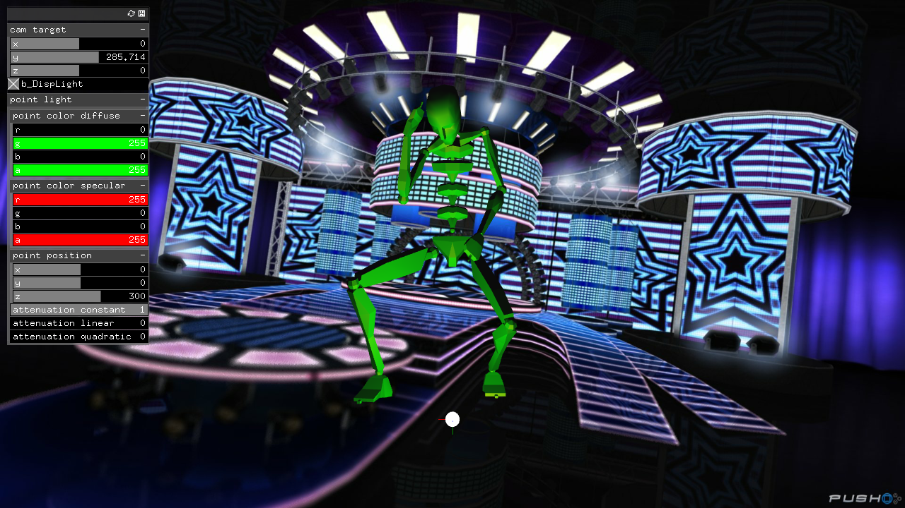

#study__ofxAssimpModelLoader

##環境
*	OS X El Capitan(10.11.6)
*	Xcode : 7.2
*	oF : 0.9.0

##add on
ofxAssimpModelLoader  
ofxGui  
ofxXmlSettings  

##Contents
3ds maxで作成したAnimtion付きmodelをloadし、これを再生する。  
Animationは、時間範囲で複数定義し、これをoF側で使い分けることも可能。  
materialの反映させ方も掲載。  
materialを反映させるためには、ofLightを使う(see also SJ-magic/study__ofLight)。  

  

##Device

##note

##3ds max File作成の注意点
同一textureを反映可能なmeshに上限があるよう(25個とか、そのくらい)。  
この上限を超えると、textureの当たったobjectが見えなくなる。  
textureは、色 or 質感 など、何でもいいので、値が1でも違えばOK。  
異なる名前であっても、全く同じ設定値だとNG。  

max上で、異なるLayerにobjectを置くことは、問題なかった。  

